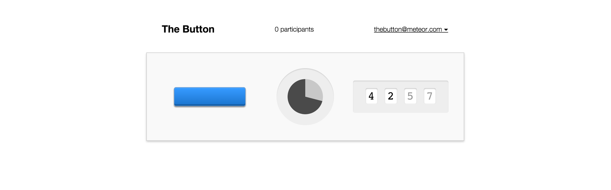

# Build your own /r/thebutton

This is the codebase accompanying the article [Build Your Own /r/thebutton]() and the [demo](http://thebutton.meteor.com). It's not intended as a full reproduction of Reddit's experiment, but as an educational exploration of what kind of approach one can use to build something like The Button. I plan to use this in Meteor workshops in the future.

Leave me any feedback here in the issues or on [Twitter](http://twitter.com/rahul).

# License

WTFPL.
